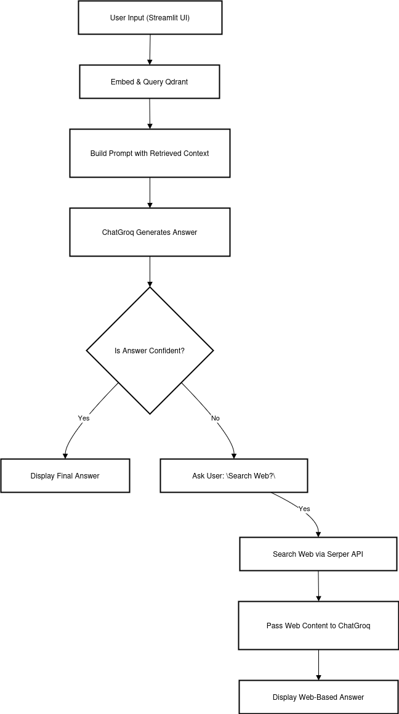

# RAG-Based QA System For Recipe 

## Setup

To install dependencies, use `uv`. First, install `uv` if you haven’t already:

### Ubuntu/Linux:
```bash
curl -LsSf https://astral.sh/uv/install.sh | sh
````

### Windows (PowerShell):

```powershell
irm https://astral.sh/uv/install.ps1 | iex
```

Then, install dependencies:

```bash
uv sync 
```

## Vector Store: Qdrant

This project uses **Qdrant** as a vector store.

You can run it locally using Docker:

```bash
docker run -p 6333:6333 -p 6334:6334 qdrant/qdrant
```

Or use **Qdrant Cloud**, which is already set up in this project.

To create your own cloud instance, go to: [https://qdrant.tech](https://qdrant.tech)

## LLM: ChatGroq

This project uses **ChatGroq**.

Set the following environment variables:

```env
GROQ_API_KEY=your_groq_api_key
QDRANT_URL=your_qdrant_cloud_url
QDRANT_API_KEY=your_qdrant_api_key
```

## Run the App

To run the project:

```bash
streamlit run app.py
```

## Flow Diagram



## Video 
<video controls src="working.mp4" title="Title"></video>
## Todo

- [ ] **Create API with FastAPI**
  - Set up FastAPI endpoints for question answering.

- [ ] **Implement Reranking Strategy for Retrieval**
  - Add a reranking approach to improve document relevance.

- [ ] **Add Pre-Rephrasing Strategy**
  - Rephrase user questions before querying Qdrant.

